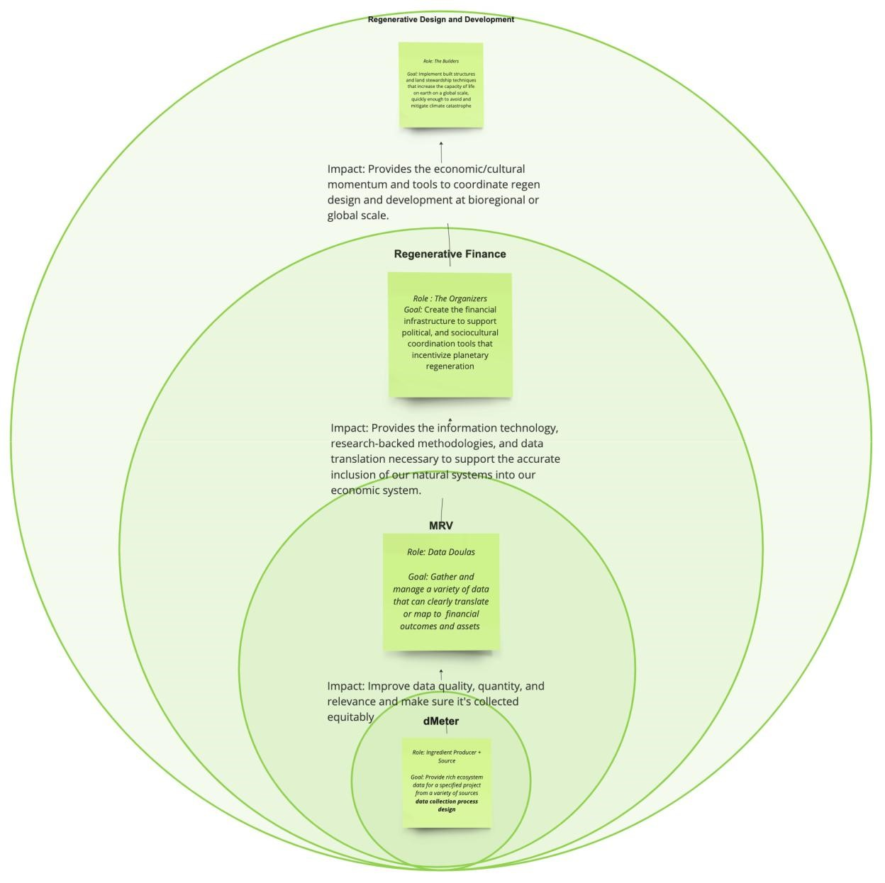

# dMeter

High Level Strategy

Our Purpose and Mission:&#x20;

Our founding purpose is to develop decentralized measurement, reporting, and verification (dMRV) systems that provide robust information to inspire, improve, and incentivize local action to regenerate our world.

&#x20;Our Vision

We see a world where communities are paid to monitor and restore their ecosystems.

Where regenerative local action informed by data gathered globally is accurately documented and adds to the cohesive global understanding of our ecosystems.

Where institutions and individuals have a nuanced understanding of specific investments in nature that would have the most transformational impact, and access to usable, cross-referenced data about their local ecosystem.

Where people and place are in a harmonious relationship, supported by rich and varied physical and digital information exchange.

MRV is decentralized, culturally aware, and holistic.

<figure><figcaption></figcaption></figure>
