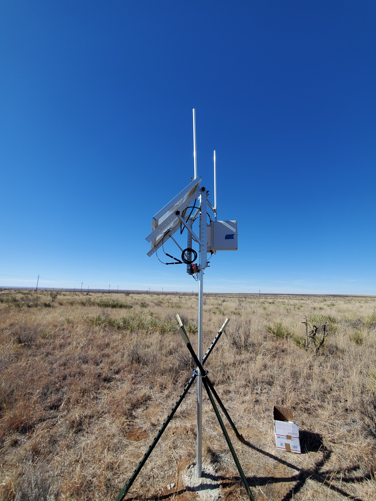
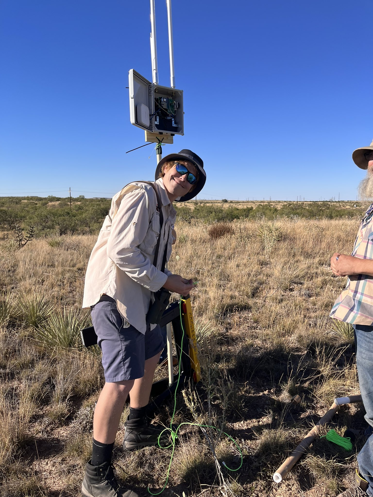
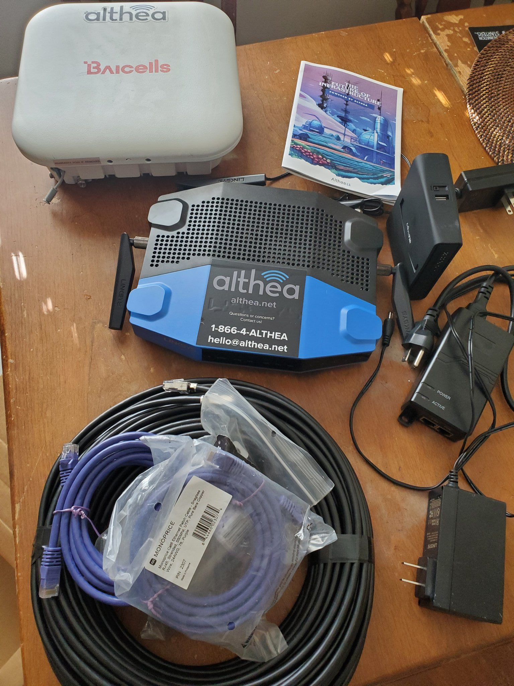
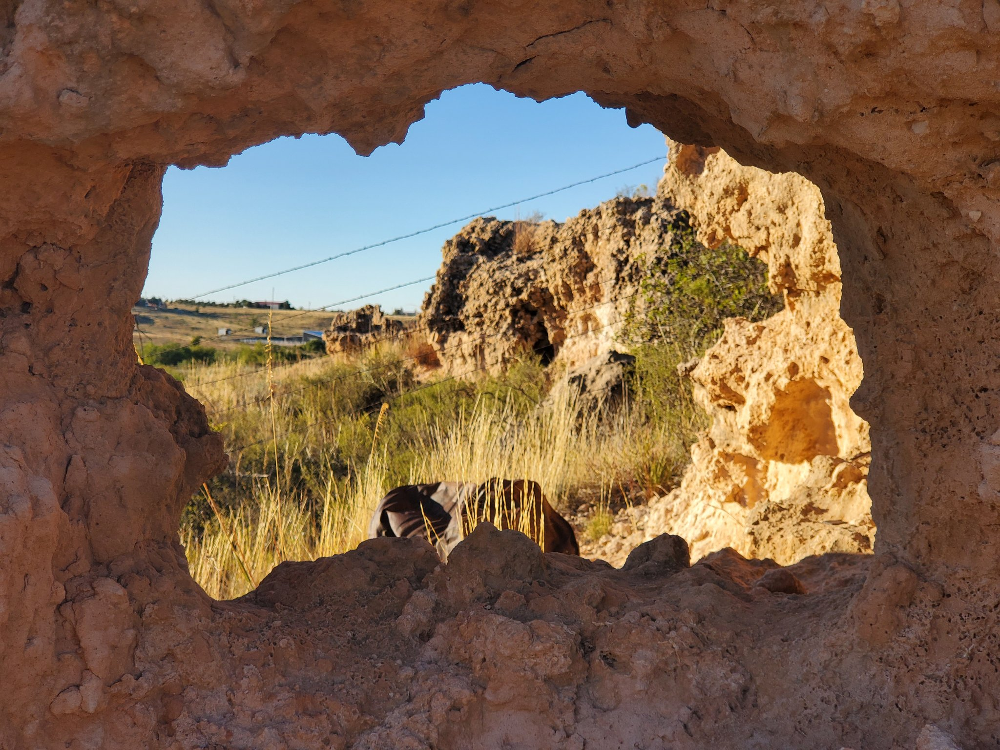
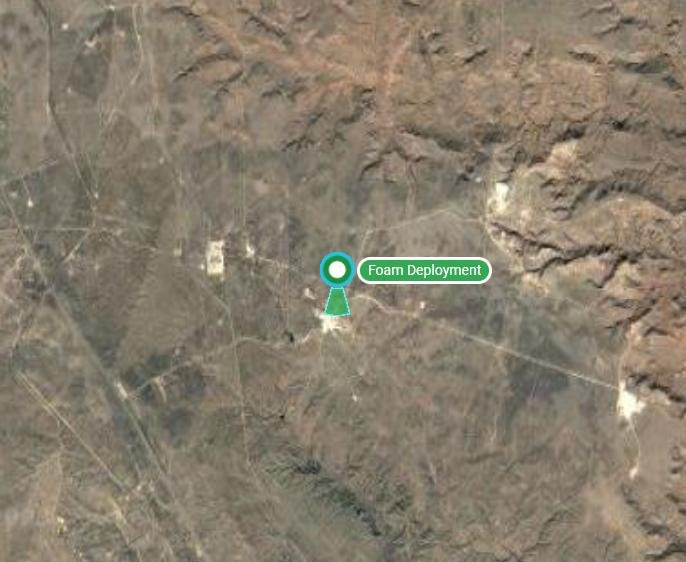

# Althea, Athena, Ogalla IOT deployment

Ogallala Life Conservation Inc is a nonprofit that works at intersection of decentralized systems, blockchain smart contract enabled tech and landscape rehydration. Our mission is to empower communities sustained by the High Plains Aquifer System to rehydrate the landscape, for resilience, improved food water material medicinal security, biodiversity & climate.

We recognize that a tremendous hurdle to the establishment of any effective comprehensive & accessible payments for ecosystem services marketplace, or natural accounting system, is the cost and inefficiencies of "traditional" contract based MRV - measure, record & verify ecological conditions. MRV is typically discussed in context of carbon credits but its' larger than that, its for public accountability.

This lead to our work and collaboration with dMeter, an unassociated trustless organization of MRV service providers, tool/product builders and interested parties including Avano, Athena Protocol, Silvi Protocol, Orgo and others that recognize the necessity of robust, diverse, decentralized, distributed ecosystems of dMRV providers, to substantiate all kinds of claims regarding ecological contracts.

A year or so ago, Athena Protocol was tasked with installing & deploying a pilot project for FOAM Protocol, specifically a FOAM Trust Zone involving 4 stationary nodes, each containing LORAWAN radio, cell/LTE modem and varied SBC's. This allows us to take measurements using IOT sensors that, accompanied w/ FOAM's dynamic radio, would "prove" location as the data gets reported to the blockchain. A more detailed explanation is best left to the FOAM team. See [https://foam.space/](https://foam.space/)

We first encountered Deborah at Althea at ReFiSummit 2023 (Seattle). She presented on RWA panel and did a fantastic job. Her interest in decentralized public infrastructure parallels ours. Althea's first buildout involve telecom. Ogallala Life has concept buildout that would involve decentralized distributed water harvest infrastructure (infiltration galleries/wells, rain gardens, etc) that allow communities to invest in water security hyperefficiently.

One of the barriers we identify to transformative ReFi is the catch-22 of establishing novel bioregional markets with the existence of any significant network of participants. Perhaps a mass distributed IOT mesh would bootstrap the formation of such a ReFi Economy? Such is our hope.

Getting back to business, our BUIDL proposal is simple. We wish to integrate at least one (of 4) FOAM nodes with Althea hardware as an alternative to the Verizon and/or ATT modems used currently. The requisite hardware is on its' way and we have a functional FOAM Zone with which to experiment. We hope to complete a build, deploy and demonstrate how to integrate FOAM LORAWAN proof of locationing with Althea decentralized internet...

<figure><figcaption>
Image of the sensor
</figcaption></figure>

<figure><figcaption>
Getting all installed.
</figcaption></figure>

<figure><figcaption>
Althea upgrade
</figcaption></figure>

<figure><figcaption>
Beautiful Landscape
</figcaption></figure>

<figure><figcaption>
Deployment Site
</figcaption></figure>

&#x20;
