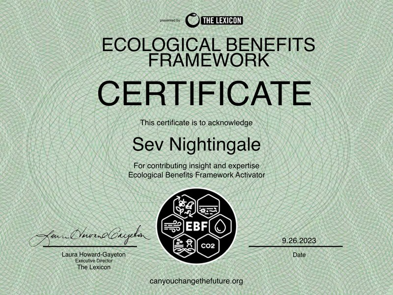

# Ecological Benefits Framework

Several of the core members of dMeter have underwent training in the Ecological Benefits Framework (EBF). This framework has already been adopted by large investement funds such as Newday. There are soon to be many other international organizations that announce their adoption.&#x20;

<figure><figcaption></figcaption></figure>
